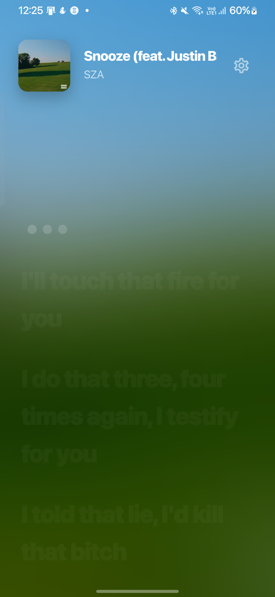
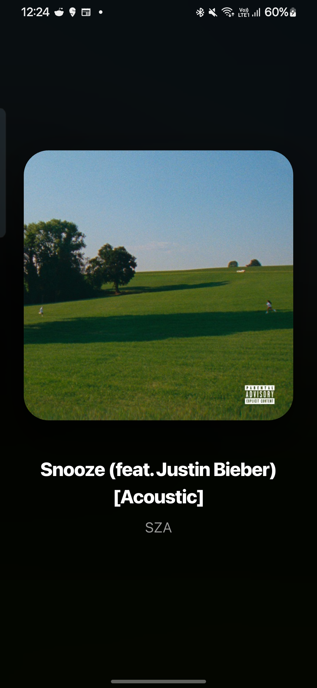
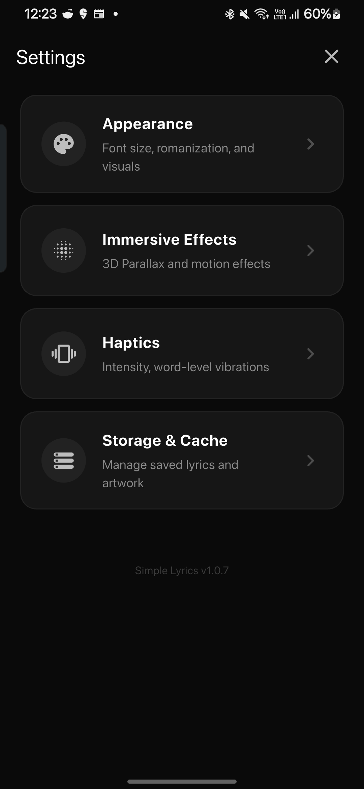

  

<h1 align="center">Simple Lyrics</h1>

  A minimalist lyrics viewer for Android with real-time synced playback.

  
  

---

  
  &nbsp;
  
  &nbsp;
  

---

## Features

- **Synced Lyrics** — Real-time karaoke-style display for the currently playing track.
- **Premium UI** — Fluid blur backgrounds, 3D parallax, and smooth animations.
- **Haptic Feedback** — Word-level synchronized vibrations.
- **Offline First** — Automatic caching for lyrics and artwork.
- **Privacy Focused** — Open source, no trackers, no ads.

## Install

- **F-Droid** — Coming soon.
- **Direct** — [Releases](https://github.com/AFcoder10/Simple-Lyrics/releases)

## License

[GPL-3.0](LICENSE)
